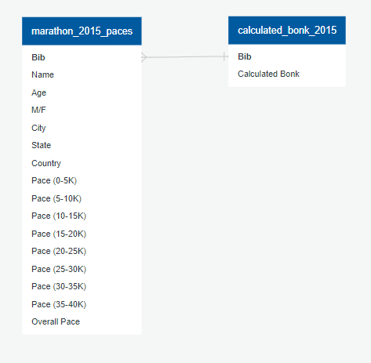

# Assesssing Marathon Results to Attempt to Predict "Bonking" in Runners

The selected topic is Marathon Race Results and phenomenon of "bonking".

Bonkers team member, Noah, is an avid runner and likes to obsess over his race finishing times. There is a lot of thought that goes into preparing for a race like a marathon which includes creating and sticking to a 4 month+ training plan, getting proper running attire, and deteriming a nutrtion strategy for optimal fueling on long runs and during the race itself. A race as long as a marathon (26.2 miles/~42.1km), requires that runners eat and drink something while they run in order to keep up their energy. Their bodies can store a lot of energy from eating extra carbohydrates in the days leading up to the race, but, physiologically, it won't last them the entire race. Thus, if the athlete doesn't replenish their body's stores of carbs, they'll experience a rapid decrease in energy levels known among marathoners as "hitting the wall", or more generically as "bonking". The result of hitting the wall is almost unanimously a drop in their running pace. This sometimes has runners reduced to walking until their bodies are able to naturally produce sugar sfficient for them to begin jogging again, or they a reach a water station and food station along the race course.

The data for this project is race results of the 2015 Boston Marathon pulled from kaggle.com (https://www.kaggle.com/datasets/rojour/boston-results?select=marathon_results_2015.csv) in text csv files. The data includes the age, gender, total race time, city/state/country of origin, and split times every 5k from the start of the race to the finish. 

Team Bonkers has chosen to analyze the topic of race results of the Boston Marathon in hopes of accurately predicting whether a participant will "hit the wall" between kilometers 30 and 35, the most common distance for racers to bonk.

Presentation draft: https://docs.google.com/presentation/d/1d8zvxBq9tTE3GMmVfpqmGNf1SueGs0KXqisng6sfEf0/edit
Tableau: https://public.tableau.com/app/profile/noah.shlesinger/viz/MarathonBonkingAnalyis/WorkingStory

## Exploring the data

Cleaning and preprocessing data occurs in the bonkers_clean_data_2015.ipynb file. Bonk calculations are in bonkers-calculations.ipynb file.

### Cleaning data

In cleaning the data, the raw CSV file is imported to Jupyter Notebooks using Pandas. Unused and unnecessary columns are removed from the dataframe and columns are converted to appropriate datatypes.

- All marathon times were converted to times in the format hh:mm:ss using the Datetime dependency.
- Pace columns were converted to minutes, rounded to 2 decimal places.
- Bib number column was set to the index.

Additionally, rows with null or invalid values were dropped. The cleaned dataset was exported to the Output_Files folder.

### Preprocessing the Data

The purpose of preprocessing the data is to create useful columns in preparation for machine learning and analysis.

The following values were calculated:
- Minutes it takes for runners to get from one milestone to the next.
- Pace for each runner in the form of minutes/kilometers

Then the pace columns for each milestone was added to the dataframe and the distance columns were removed. Finally, the dataframe is exported as CSV, and SQLAlchemy is used to export the dataframe to the SQL Database.

### Bonk Calculations
In order to calculate if a runner "bonked", the cleaned and preprocessed data is imported from SQL. 

Then, the pace from 20-30K is compared to the pace from 30-35K for each runner. If the percent difference decreases by 10%, then the runner has "bonked" and it is indicated by a '1' in a new "bonk" table. 

The table is then exported and saved to SQL.

## Database

SQL is used as the database for this project. The cleaned and preprocessed data is saved to SQL, as well as the "bonk" table, which is produced from the preprocessed data.

In order to analyze and use the data in machine learning, the preprocessed data is joined to the "bonk" table. These two tables are "left joined" using a SQL query. The tables are joined according to the following ERD.

